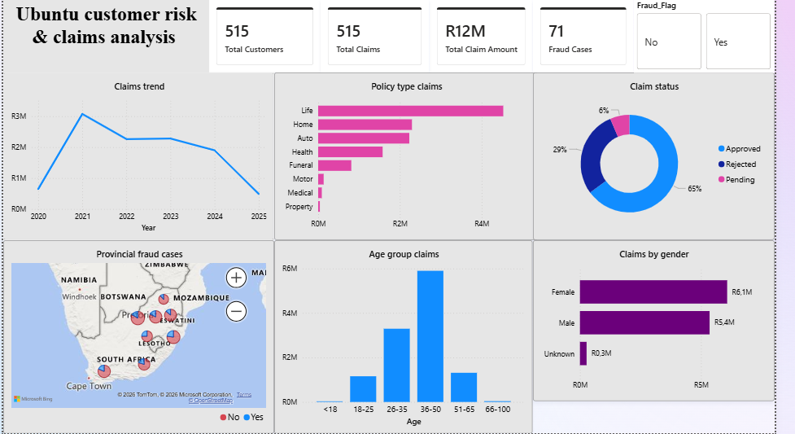

# Insurance_claims_analysis #

# OBJECTIVE #
1. Increasing claim costs
2. Suspected fraudulent claims
3. Low customer retention

## TOOLS #
# 1. SQL
Data exploring
Data cleaning

# 2. POWER BI
Data transformation & visualisation

# DATA STORY TELLING
1. Claims decrease overtime due to the economic impact of Covid-19
2. Life Insurance policy is the most claimed policy
3. Monthly income declines resulting in low customer retention
4. Fraudulent claims are mostly witnessed in customers between the ages 35-50

# RECOMMENDATION
1. Invest in advanced analytics and machine learning to forecast claim probabilities and detect high-risk behaviour early.
2. Strengthen risk mitigation by offering premium incentives, customer education, and lifestyle-based reward programs.
3. Improve fraud detection by cross-referencing external data sources and using geospatial analysis to identify suspicious patterns and high-risk areas.
 

